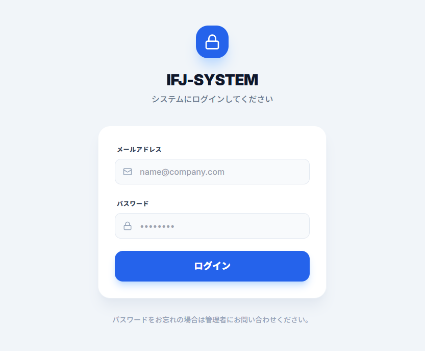
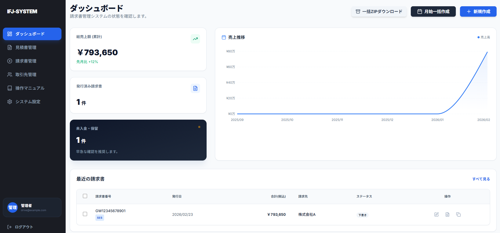
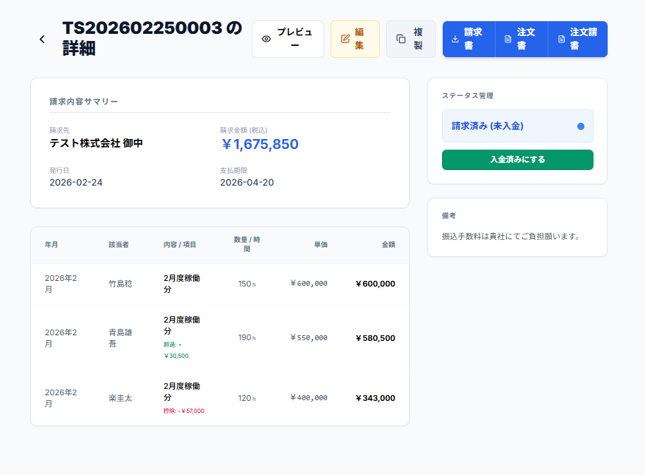
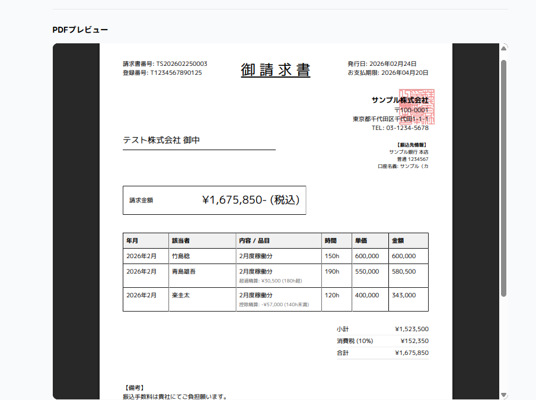
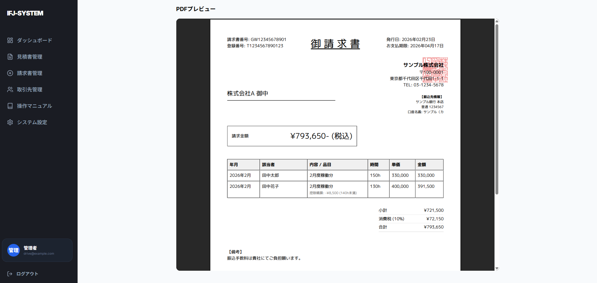

# SES業界特化型 請求書管理システム (Invoice Flow Japan)

## ログイン画面

## ダッシュボード画面

## 請求書作成・編集画面


## 請求書PDFプレビュー画面

## マニュアル操作画面


SES業界の商習慣に最適化した、高機能な請求書・見積書管理システムです。
超過・控除の自動計算、契約更新アラート、電帳法準拠の検索機能などを備えています。

## 🚀 技術スタック
- **Framework**: Next.js 14 (App Router)
- **Language**: TypeScript
- **Database**: PostgreSQL (Prisma ORM)
- **Auth**: NextAuth.js
- **Styling**: Tailwind CSS / Shadcn UI
- **PDF**: @react-pdf/renderer

---

## 🛠️ 事前準備
セットアップ前に以下のツールがインストールされていることを確認してください。

- **Node.js**: v18.x 以上
- **Docker & Docker Compose**: データベース（PostgreSQL）の起動に使用
- **Git**: リポジトリのクローンに使用

---

## 📥 セットアップ手順

### 1. リポジトリのクローン
```bash
git clone https://github.com/ShoukiYano/IFJ-SYSTEM.git
cd IFJ-SYSTEM
```

### 2. 環境変数の設定
`.env.example` をコピーして `.env` ファイルを作成し、パスワードを設定します。

```bash
cp .env.example .env
```

`.env` を開いて `POSTGRES_PASSWORD` と `DATABASE_URL` の **2箇所のパスワードを同じ値** に設定してください。

```env
# 例: 好きなパスワードを設定する
POSTGRES_PASSWORD=あなたのパスワード

# ↓ DATABASE_URLの中のパスワードも同じ値に変更する
DATABASE_URL="postgresql://postgres:あなたのパスワード@db:5432/invoice_db?schema=public"
```

> ⚠️ **注意**: `.env` ファイルは Git にコミットされません（`.gitignore` で除外済み）。
> パスワードを他人に共有しないようにしてください。

### 3. アプリケーションの起動 (Docker)
以下のコマンドを実行するだけで、データベースとアプリケーションの両方が起動します。
初回起動時はビルドと依存関係のインストールが行われます。
#### ※場所、処理速度によって時間がかかる場合があります。
#### 実行完了時間　平均15分程度

```bash
docker-compose up --build
```

### Linuxの場合、Dockerが入っていないと思うので下記を追加
```bash
sudo apt update
sudo apt install -y docker.io docker-compose-plugin
sudo systemctl enable --now docker
sudo usermod -aG docker $USER
newgrp docker
docker ps
docker compose up --build
```

---

## 🌐 動作確認
起動が完了したら、ブラウザで以下のURLにアクセスしてください。

**[http://localhost:3000](http://localhost:3000)**

---

### GUIではなくターミナルで起動したい場合
```bash
#起動
sudo docker compose up --build app db

#停止
sudo docker compose down
```

### 4. データベースの初期化 (初回のみ)
コンテナが起動している状態で、別のターミナルから以下のコマンドを実行してテーブルの作成と初期データの投入（管理者登録）を行います。

```bash
docker-compose exec app npx prisma migrate dev --name init
docker-compose exec app npx prisma db seed
```

---

## 🍎 Macでの構築手順（詳細）

> この手順は macOS（Intel・Apple Silicon 両対応）向けです。  
> ターミナル（`Terminal.app` または `iTerm2`）を開いて進めてください。

---

### Step 1: Homebrew のインストール（未インストールの場合）

Homebrew は Mac のパッケージマネージャーです。ターミナルを開いて以下を実行してください。

```bash
/bin/bash -c "$(curl -fsSL https://raw.githubusercontent.com/Homebrew/install/HEAD/install.sh)"
```

インストール後、**Apple Silicon (M1/M2/M3)** の場合は以下で PATH を通します：

```bash
echo 'eval "$(/opt/homebrew/bin/brew shellenv)"' >> ~/.zprofile
eval "$(/opt/homebrew/bin/brew shellenv)"
```

動作確認：
```bash
brew --version
# 例: Homebrew 4.x.x
```

---

### Step 2: Node.js のインストール（nvm 推奨）

`nvm`（Node Version Manager）を使うと Node.js のバージョン管理が簡単になります。

```bash
# nvm のインストール
curl -o- https://raw.githubusercontent.com/nvm-sh/nvm/v0.39.7/install.sh | bash
```

インストール後、ターミナルを **再起動** するか、以下で反映させます：

```bash
source ~/.zshrc
# bash を使っている場合
# source ~/.bashrc
```

動作確認と Node.js のインストール：

```bash
nvm --version
# 例: 0.39.7

# Node.js v18（LTS）をインストール
nvm install 18
nvm use 18

node -v   # 例: v18.x.x
npm -v    # 例: 9.x.x
```

---

### Step 3: Docker Desktop for Mac のインストール

1. [https://www.docker.com/products/docker-desktop/](https://www.docker.com/products/docker-desktop/) にアクセスします。
2. **「Download for Mac」** をクリックします。
   - Intel Mac → `Docker Desktop for Mac (Intel Chip)` をダウンロード
   - Apple Silicon (M1/M2/M3) → `Docker Desktop for Mac (Apple Silicon)` をダウンロード
3. ダウンロードした `.dmg` ファイルを開き、Docker を `Applications` フォルダにドラッグします。
4. アプリケーションから **Docker Desktop** を起動します。
5. メニューバーに 🐳 アイコンが表示され、`Docker Desktop is running` となれば起動完了です。

> **Homebrew でインストールする方法**（任意）：
> ```bash
> brew install --cask docker
> ```
> インストール後、アプリケーションから Docker Desktop を起動してください。

動作確認：
```bash
docker --version
# 例: Docker version 24.x.x
docker compose version
# 例: Docker Compose version v2.x.x
```

---

### Step 4: リポジトリのクローン

```bash
git clone https://github.com/ShoukiYano/IFJ-SYSTEM.git
cd IFJ-SYSTEM
```

---

### Step 5: 環境変数の設定

```bash
cp .env.example .env
```

`.env` をエディタで開き、パスワードを設定します：

```bash
# VS Code を使う場合
code .env

# テキストエディット（メモ帳相当）で開く場合
open -e .env
```

`.env` の中身（`POSTGRES_PASSWORD` と `DATABASE_URL` の2箇所のパスワードを同じ値に設定）：

```env
POSTGRES_PASSWORD=あなたのパスワード ← 好きなパスワードを設定

DATABASE_URL="postgresql://postgres:あなたのパスワード@db:5432/invoice_db?schema=public"
↑
これはパスワード変更しなくてOK
```

> ⚠️ `.env` ファイルは Git にコミットされません（`.gitignore` で除外済み）。  
> パスワードを他人に共有しないでください。

---

### Step 6: アプリケーションの起動（Docker）

Docker Desktop が起動していることを確認してから実行します：

```bash
docker compose up --build
```

> 初回はイメージのビルドや依存関係のインストールが行われるため、**15〜20分程度**かかることがあります。

`app_1 | Ready on http://localhost:3000` のような表示が出れば起動完了です。

---

### Step 7: データベースの初期化（初回のみ）

コンテナが起動している状態で、**別のターミナルタブ**を開いて以下を実行します：

```bash
docker compose exec app npx prisma migrate dev --name init
docker compose exec app npx prisma db seed
```

完了後、ブラウザで [http://localhost:3000](http://localhost:3000) にアクセスして動作確認してください。

---

### よく使うコマンド（Mac）

| 操作 | コマンド |
|---|---|
| 起動 | `docker compose up --build` |
| バックグラウンドで起動 | `docker compose up -d --build` |
| 停止 | `docker compose down` |
| ログを確認 | `docker compose logs -f app` |
| コンテナ内に入る | `docker compose exec app sh` |
| ポート確認 | `lsof -i :3000` |

---

## 🛠️ ローカル開発（Dockerを使わない場合）

1. `npm install`
2. データベースのみ Docker で起動: `docker-compose up -d db`
3. `npx prisma migrate dev`
4. `npm run dev`

---

## 🖥️ OS別の補足情報

### 🪟 Windows
- **Terminal**: PowerShell または Git Bash を推奨します。
- **Docker**: Docker Desktop for Windows をインストールし、WSL2 バックエンドを有効にしてください。
- **実行ポリシー**: PowerShellでスクリプトが実行できない場合は、管理者権限で `Set-ExecutionPolicy RemoteSigned` を実行してください。

### 🐧 Linux (Ubuntu/Debian)
- **Docker**: `sudo` なしで Docker を実行できるように、ユーザーを `docker` グループに追加することを推奨します。
  ```bash
  sudo usermod -aG docker $USER
  ```
- **Port**: 3000番ポートが他のサービスで使用されていないか確認してください（`sudo lsof -i :3000`）。

### 🍎 Mac (Intel/Apple Silicon)
- **詳細手順**: 上の「🍎 Macでの構築手順（詳細）」セクションを参照してください。
- **Docker**: Docker Desktop for Mac を使用してください（`brew install --cask docker` でも可）。
- **Node.js**: `nvm` を使用したインストールを推奨します。
- **Apple Silicon (M1/M2/M3)**: Dockerイメージは `postgres:15-alpine` を使用しているため、マルチプラットフォーム対応で問題なく動作します。
- **Homebrew がない場合**: まず Homebrew をインストールしてください（手順は上記を参照）。
- **Port 確認**: 3000番ポートが他のサービスで使用されていないか確認してください（`lsof -i :3000`）。

---

## 📖 主な機能
- **SES精算機能**: 超過・控除の自動計算（テンプレート切り替え可能）
- **契約管理**: 契約終了2ヶ月前のアラート通知
- **一括操作**: 請求書のバルク作成、一括ZIPダウンロード
- **検索機能**: 電帳法準拠（取引先・日付・金額範囲での検索）
- **ドキュメント作成**: 請求書・見積書・注文書・注文請書のPDF出力

---

## 🧪 テスト実施手順

### 前提条件

| 項目 | 必要なもの |
|------|-----------|
| 単体テスト・統合テスト | `node_modules` のインストール済み（`npm install`） |
| E2Eテスト | Dockerでアプリが起動中（`docker-compose up`） + Playwrightブラウザのインストール |

---

### 単体テスト・統合テスト（Jest）

> Dockerは不要。ローカルの `node_modules` だけで実行できます。

```bash
# 全Jestテスト（単体 + 統合）を実行
npm test

# 単体テストのみ実行
npm run test:unit

# 統合テストのみ実行
npm run test:integration
```

**テスト対象：**

| テストスイート | 内容 |
|--------------|------|
| `tests/unit/dateUtils.test.ts` | 支払期限計算・祝日判定・サービス月チェック |
| `tests/unit/utils.test.ts` | 通貨フォーマット・消費税計算・請求書番号生成 |
| `tests/unit/sesCalculation.test.ts` | SES超過・控除・精算幅からの自動単価計算 |
| `tests/integration/api.invoices.test.ts` | Prismaレイヤーのフィルタ・CRUD動作確認 |

---

### E2Eテスト（Playwright）

> **事前に `docker-compose up` でアプリを起動してください。**  
> 初回のみブラウザのインストールが必要です。

```bash
# 初回のみ: Playwrightブラウザをインストール
npx playwright install --with-deps chromium

# E2Eテスト実行（ヘッドレス）
npm run test:e2e

# UIモードで実行（テストの動作を画面で確認できる）
npm run test:e2e:ui
```

**E2Eテスト対象：**

| テストファイル | 内容 |
|--------------|------|
| `tests/e2e/login.spec.ts` | 正常ログイン・誤パスワード・未認証リダイレクト・ログアウト |

**E2Eテストで使うアカウント（`prisma db seed` で作成）：**

```
メールアドレス: drive@example.com
パスワード:     drive1001
```

---

### 全テストを一括実行

```bash
# Jest（単体+統合）→ E2E の順で実行
npm run test:all
```

---

### テスト失敗時の確認先

```bash
# Jestの詳細ログを表示
npm test -- --verbose

# E2Eのレポートを開く（失敗時のスクリーンショット・動画を確認）
npx playwright show-report
```

> 📁 Playwrightのテスト結果は `playwright-report/` に出力されます（Gitignore済み）。

---

## 📝 ライセンス
商用利用・改変についてはプロジェクト管理者にお問い合わせください。
